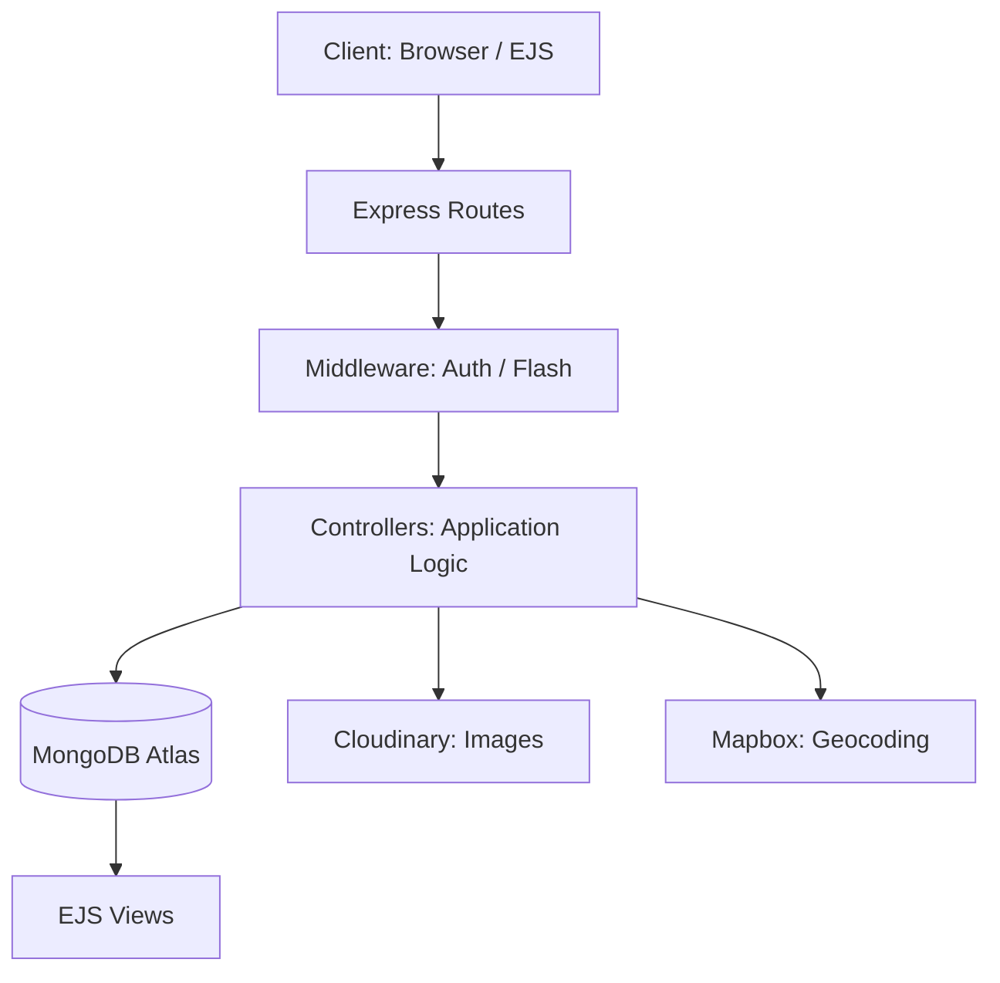
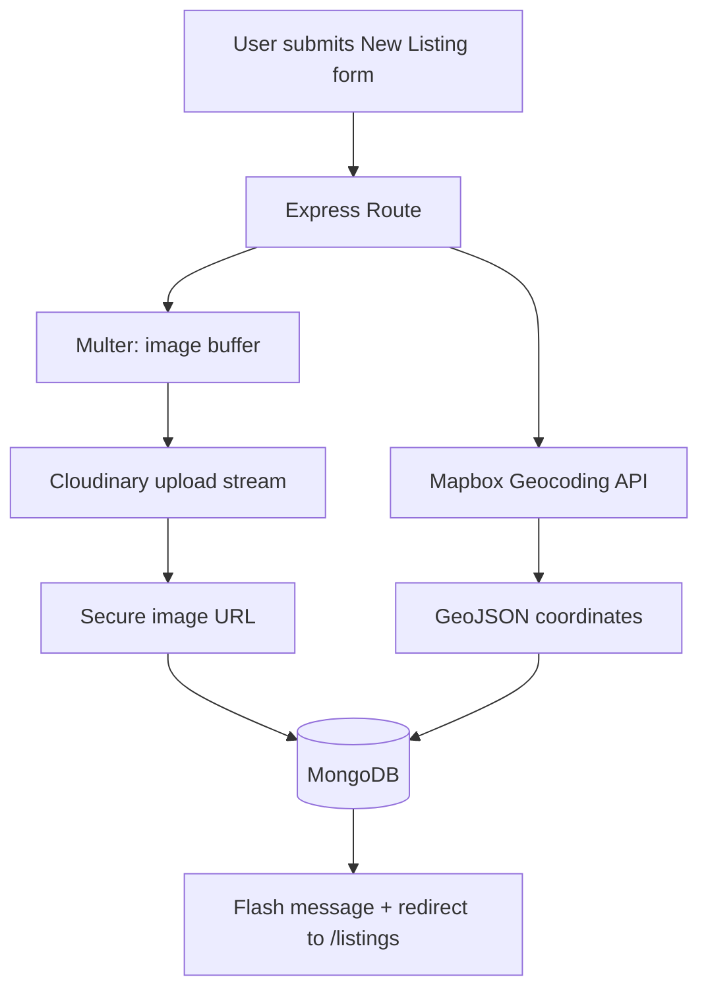
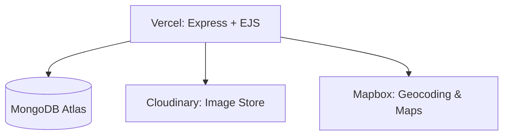

<div align="center">

# 🌍 Wanderlust

### Full-Stack Travel Listing Platform

*Explore. Discover. Travel.*


</div>

---

Wanderlust is a dynamic travel listing platform built with **Node.js, Express.js, MongoDB, EJS, Passport.js, Cloudinary, and Mapbox**. Users can explore destinations, create and manage listings, upload images, view locations on interactive maps, authenticate securely, and share ratings and reviews.

The project was built to understand the complete lifecycle of a modern full-stack application: server-side rendering, RESTful routing, database design, authentication and sessions, cloud image storage, geocoding, third-party API integration, and production deployment.

## 📌 Table of Contents

- [Features](#-features)
- [Tech Stack](#️-tech-stack)
- [Architecture](#️-architecture)
- [How It Works](#-how-it-works)
- [Database Models](#️-database-models)
- [Route Structure](#-route-structure)
- [Project Structure](#-project-structure)
- [Environment Variables](#-environment-variables)
- [Local Installation](#-local-installation)
- [Deployment](#-deployment)
- [Security](#-security)
- [Error Handling](#-error-handling)
- [Future Improvements](#-future-improvements)
- [What This Project Demonstrates](#-what-this-project-demonstrates)
- [Author](#-author)
- [License](#-license)

## ✨ Features

### 🏠 Travel Listings (Full CRUD)
- Browse all destinations and view individual listing details
- Create, edit, and delete listings
- View destination image, location, country, price, and description
- Each listing is stored as a MongoDB document via Mongoose

### 🔐 Authentication & Authorization
- Session-based authentication with **Passport.js**, **Passport Local**, and **Passport Local Mongoose**
- Sign up (with automatic login), log in, and log out
- Protected routes for creating, editing, and deleting listings
- Custom middleware using `req.isAuthenticated()` that redirects unauthenticated users to the login page with a flash message

### 👤 MongoDB-Backed Sessions
Sessions are persisted with `express-session` and `connect-mongo` on MongoDB Atlas rather than in-memory storage, so session data doesn't depend on a single server process, which makes it better suited to production deployment.

```
Express Session → Connect-Mongo → MongoDB Atlas
```

### ⭐ Reviews & Ratings
- Add a review with a written comment and a **1–5** rating
- View all reviews on a listing, with creation dates
- Delete reviews
- Reviews are stored in their own collection and referenced from the parent listing

### 🖼️ Cloud Image Uploads
Images are uploaded to **Cloudinary**, so the app doesn't rely on a permanent local filesystem. This suits cloud deployment environments. Each listing stores the Cloudinary `filename` (public ID) and secure `url`.

### 🗺️ Interactive Maps
When a listing is created or updated, its **location + country** is sent to the **Mapbox Geocoding API**. The returned coordinates are stored as GeoJSON, then used on the listing page to center the map, place a marker, and show a location popup.

### 💬 Flash Messages
Temporary notifications via `connect-flash`, for example:
- ✅ `Success! Listing Saved.` / `Listing updated successfully!` / `Listing deleted successfully!`
- ✅ `Welcome to Wanderlust!` / `You are logged out!`
- ❌ `You must be logged in to create a listing!`
- ❌ `A user with the given username is already registered`

## 🛠️ Tech Stack

| Layer | Technology | Purpose |
|---|---|---|
| **Frontend** | HTML5, CSS3, JavaScript | Structure, styling, client-side behavior |
| | EJS + EJS-Mate | Server-side templating and layouts |
| | Bootstrap + Bootstrap Icons | Responsive UI and icons |
| **Backend** | Node.js, Express.js | Runtime and web framework |
| | Method-Override | PUT/DELETE from HTML forms |
| | Passport.js, Passport Local, Passport Local Mongoose | Authentication |
| | Express Session, Connect-Mongo, Connect-Flash | Sessions and notifications |
| | Multer | Multipart file handling |
| **Database** | MongoDB Atlas, Mongoose | Storage, schemas, validation, relationships |
| **Cloud Services** | Cloudinary | Image upload and hosting |
| | Mapbox | Geocoding, maps, markers |

## 🏗️ Architecture

Wanderlust follows a modular Express/MVC-style architecture.



## 🔄 How It Works

### Creating a Listing



### Image Upload Pipeline

```
Listing Form → Multer → Memory Storage → Image Buffer
             → Cloudinary Upload Stream → secure_url → MongoDB
```

### Location Storage (GeoJSON)

Locations are stored as GeoJSON `Point` objects, using `[longitude, latitude]` order:

```json
{
  "geometry": {
    "type": "Point",
    "coordinates": [88.3639, 22.5726]
  }
}
```

This also lays the foundation for future geospatial features such as nearby listings, radius searches, and map-based discovery.

### Listing Detail Page

`GET /listings/:id` loads the listing, its image, reviews, and GeoJSON coordinates, then renders the details, reviews, and an interactive Mapbox map.

### Authentication Flows

```
Signup:  Form → User.register() → password hashing (Passport Local Mongoose)
              → user saved → auto login → session created → redirect to listings

Login:   Form → Passport Local Strategy → credentials verified
              → session created → redirect to listings

Logout:  req.logout() → session removed → flash message → redirect to listings
```

## 🗄️ Database Models

Collections: **Users**, **Listings**, **Reviews**, **Sessions**

**User**: authentication data (handled by Passport Local Mongoose) and email.

**Listing**

| Field | Description |
|---|---|
| `title`, `description`, `price`, `location`, `country` | Core listing details |
| `image` | `{ filename, url }` (Cloudinary) |
| `geometry` | `{ type, coordinates }` (GeoJSON Point) |
| `reviews` | Array of `ObjectId` references to Review documents |

**Review**

| Field | Description |
|---|---|
| `comment` | Written feedback |
| `rating` | Number, min `1`, max `5` |
| `createdAt` | Creation timestamp |

## 🔗 Route Structure

**Listings**

| Method | Route | Purpose |
|---|---|---|
| GET | `/listings` | Display all listings |
| GET | `/listings/new` | Display new listing form |
| POST | `/listings` | Create a listing |
| GET | `/listings/:id` | Display a specific listing |
| GET | `/listings/:id/edit` | Display edit form |
| PUT | `/listings/:id` | Update a listing |
| DELETE | `/listings/:id` | Delete a listing |

**Authentication**

| Method | Route | Purpose |
|---|---|---|
| GET | `/signup` | Display signup page |
| POST | `/signup` | Create new user |
| GET | `/login` | Display login page |
| POST | `/login` | Authenticate user |
| GET | `/logout` | Log user out |

**Reviews**

| Method | Route | Purpose |
|---|---|---|
| POST | `/listings/:id/reviews` | Add a review |
| DELETE | `/listings/:id/reviews/:reviewId` | Delete a review |

## 📂 Project Structure

```
WANDERLUST_FULL-STACK/
│
├── controllers/
│   ├── listings.js
│   ├── post.js
│   └── users.js
│
├── models/
│   ├── listing.js
│   ├── review.js
│   └── user.js
│
├── routes/
│   ├── listing.js
│   ├── posts.js
│   └── user.js
│
├── views/
│   ├── listings/
│   ├── users/
│   └── layout/
│
├── public/
│   ├── css/
│   └── js/
│
├── utils/
│   ├── ExpressError.js
│   └── wrapAsync.js
│
├── init/                 # data initialization files
│
├── app.js
├── cloudConfig.js
├── middleware.js
├── package.json
├── package-lock.json
├── .gitignore
└── .env                  # local only, never committed
```

## 🔑 Environment Variables

Create a `.env` file in the project root:

```env
ATLASDB_URL=your_mongodb_connection_string

CLOUD_NAME=your_cloudinary_cloud_name
CLOUD_API_KEY=your_cloudinary_api_key
CLOUD_API_SECRET=your_cloudinary_api_secret

MAP_TOKEN=your_mapbox_token

SECRET=your_session_secret
```

> [!IMPORTANT]
> Never commit your `.env` file. Your `.gitignore` should contain:
> ```
> node_modules/
> .env
> .vercel/
> ```

## 🚀 Local Installation

**1. Clone the repository**

```bash
git clone <YOUR_GITHUB_REPOSITORY_URL>
cd WANDERLUST_FULL-STACK
```

**2. Install dependencies**

```bash
npm install
```

**3. Configure environment variables**

Create the `.env` file described [above](#-environment-variables) and replace the placeholders with your own credentials.

**4. Start the application**

```bash
node app.js
```

The app runs at **http://localhost:8080**.

## 🌐 Deployment

Wanderlust is designed for cloud deployment. A typical production setup:



Configure `ATLASDB_URL`, `CLOUD_NAME`, `CLOUD_API_KEY`, `CLOUD_API_SECRET`, `MAP_TOKEN`, and `SECRET` through your hosting platform's environment-variable settings.

## 🔒 Security

- Password handling through Passport Local Mongoose
- Session-based authentication with MongoDB-backed sessions
- Authentication middleware on protected routes
- Mongoose schema validation
- Credentials kept in environment variables, never hardcoded (MongoDB credentials, Cloudinary API secret, Mapbox token, session secret)
- `.env` excluded from Git tracking
- External image storage via Cloudinary

## 🧪 Error Handling

A reusable `wrapAsync()` helper forwards asynchronous controller errors to Express's centralized error-handling middleware, replacing repetitive `try/catch` blocks:

```js
// Instead of:
try {
  // async operation
} catch (err) {
  next(err);
}

// controllers simply use:
wrapAsync(async (req, res) => { /* ... */ });
```

A custom `ExpressError` utility creates application-specific HTTP errors.

## 📈 Future Improvements

- 🔎 **Search & discovery:** search by destination, country, or location; filter by price, rating, or category
- 🗺️ **Geospatial features:** nearby destinations, radius search, distance calculation, geospatial MongoDB queries, map-based discovery
- 👤 **User features:** profile pages, dashboards, profile pictures, listing ownership, activity history
- ❤️ **Wishlist:** save and manage favourite destinations
- 🖼️ **Advanced images:** multiple images per listing, galleries, reordering, deletion from Cloudinary
- 🏨 **Booking system:** booking requests, availability, reservation history, confirmations
- 📱 **PWA:** offline support, installable app, push notifications
- 🧪 **Testing & production readiness:** unit, integration, and API tests; logging and monitoring; improved validation; better error pages; accessibility improvements

## 📚 What This Project Demonstrates

| Area | Skills |
|---|---|
| **Backend** | Node.js, Express.js, RESTful routing, middleware, controllers, MVC-style architecture, error handling, async programming |
| **Database** | MongoDB, Atlas, Mongoose schemas and models, references, CRUD, GeoJSON |
| **Authentication** | Passport.js, Passport Local, Passport Local Mongoose, sessions, MongoDB session storage, protected routes |
| **Frontend** | HTML, CSS, JavaScript, EJS and layouts, Bootstrap, responsive design |
| **Cloud & APIs** | Cloudinary, Mapbox, geocoding APIs, cloud image storage, environment variables |

🔗 **Live Demo:** https://wander-lust-six-wine.vercel.app/listings

### 🛠️ Development Journey

The project was built incrementally:

Express app → EJS templates → MongoDB + Mongoose → CRUD listings → Reviews → Authentication (Passport.js) → Sessions → Flash messages → Multer uploads → Cloudinary → Mapbox geocoding → GeoJSON storage → Interactive maps → MongoDB session storage → Production deployment prep

## 👨‍💻 Author

**Rajdeep Roy**

**Areas of interest:** Full-Stack Development · Software Engineering · Data Structures & Algorithms · Machine Learning · Automation & Instrumentation

## 📄 License

This project is primarily intended for educational, learning, and portfolio purposes. If you use or modify it, please provide appropriate attribution to the original author.

## ⭐ Support

If you find this project useful, consider giving the repository a ⭐ on GitHub.

---

<div align="center">

**🌍 Wanderlust: Explore. Discover. Travel.**

Built by **Rajdeep Roy**

</div>
